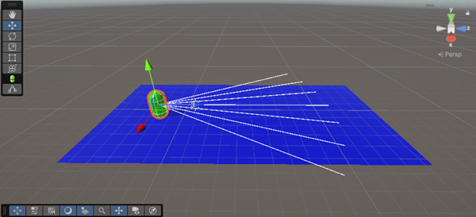
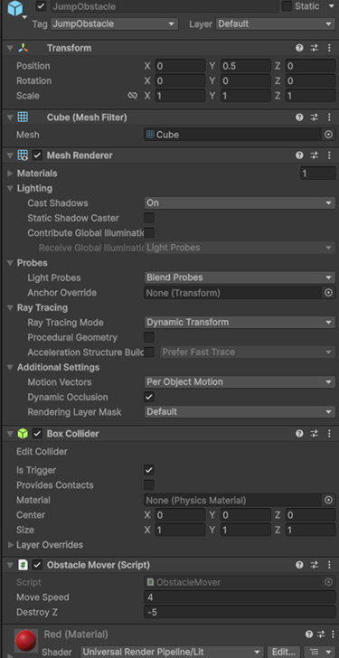
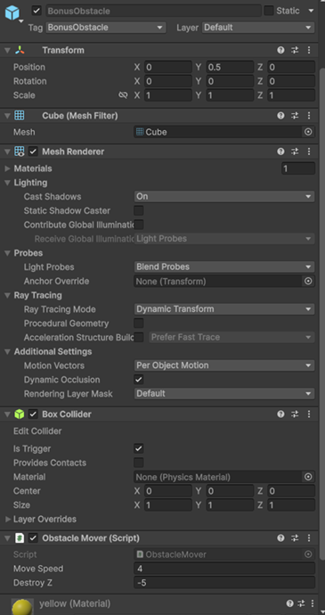
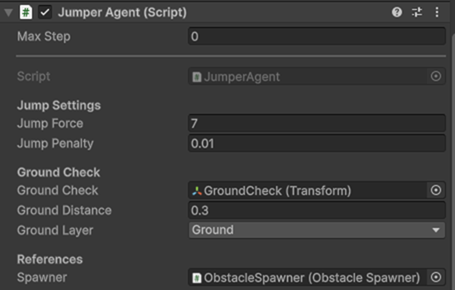
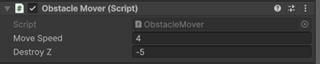
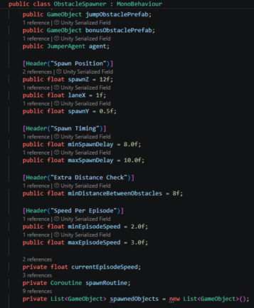
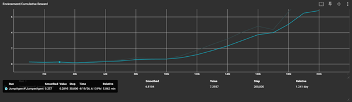

# Jumper Verslag

## Doel

De agent moet over de rode objecten springen en de gele objecten oppakken (bonusfunctionaliteit gekozen).  
De objecten moeten in elke episode een andere snelheid hebben.

## Map

Ik heb een **Plane** gebruikt als grond met als layer `ground`. Dit wordt gebruikt om te controleren of de agent geland is of op de grond staat.  

Voor de agent heb ik een **Capsule** gebruikt met:

- Rigidbody  
- Collider  
- Empty GameObject `CheckGround`  
- Ray Perceptions  
- `JumperAgent` script

## Obstacles

### JumperObstacle

Dit is het object waarover de agent moet springen.  
Deze heeft:

- Collider  
- `ObstacleMover` script

### BonusObstacle

Dit is het object dat de agent moet oppakken.  
Deze heeft:

- Collider  
- Hetzelfde `ObstacleMover` script

## Scripts

### JumperAgent Script

Bevat:

- Jump settings  
- Ground check  
- Gebruik van `ObstacleSpawner` script

### ObstacleMover Script

Bevat:

- Snelheid van het object  
- Wanneer het object vernietigd wordt

### ObstacleSpawner Script

Bevat:

- Spawnlogica  
- Timing van objecten  
- Spawn delay zodat objecten niet te snel achter elkaar spawnen  
- Minimale en maximale snelheid van objecten (moet variëren)

## Training

In de trainresultaten is te zien dat de grafiek een duidelijke vooruitgang laat zien.

- Tijdens de eerste **100k stappen** bleef de cumulatieve beloning laag en steeg deze langzaam.  
  Dit betekent dat de agent in het begin vooral nog aan het verkennen was.

- Vanaf ongeveer **120k stappen** stijgt de beloning sneller.  
  Dit laat zien dat de agent betere keuzes begon te maken.

- Tussen de **180k en 200k stappen** bereikt de agent zijn hoogste score van ongeveer **7 punten**.  
  Dit laat zien dat de agent uiteindelijk een goede strategie heeft geleerd.
